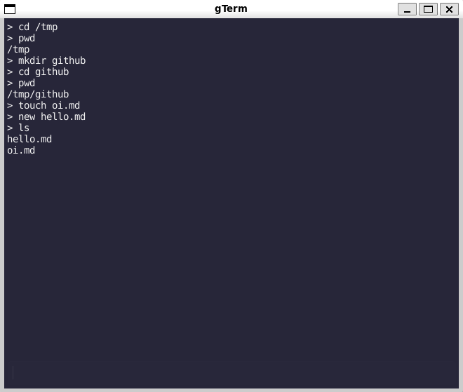

# gterm
A minimal Golang terminal emulator

## List of Commands

 - cat or dog (for all dog fans)   
 - cd
 - clear
 - copy or cp
 - rm, remove, del, or delete
 - env
 - ls or dir
 - mkdir
 - mv or move
 - pwd
 - touch or new
